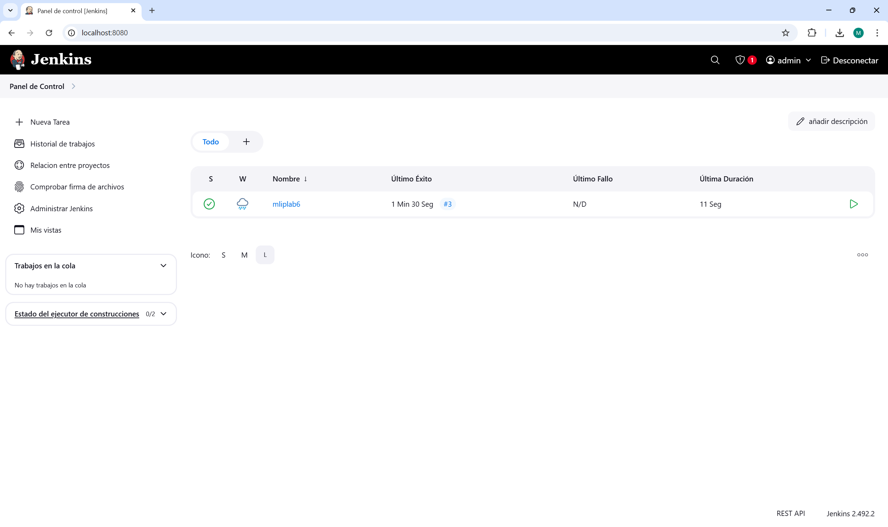
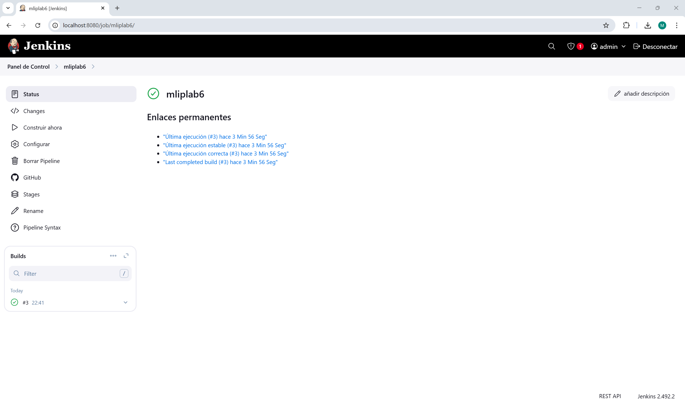
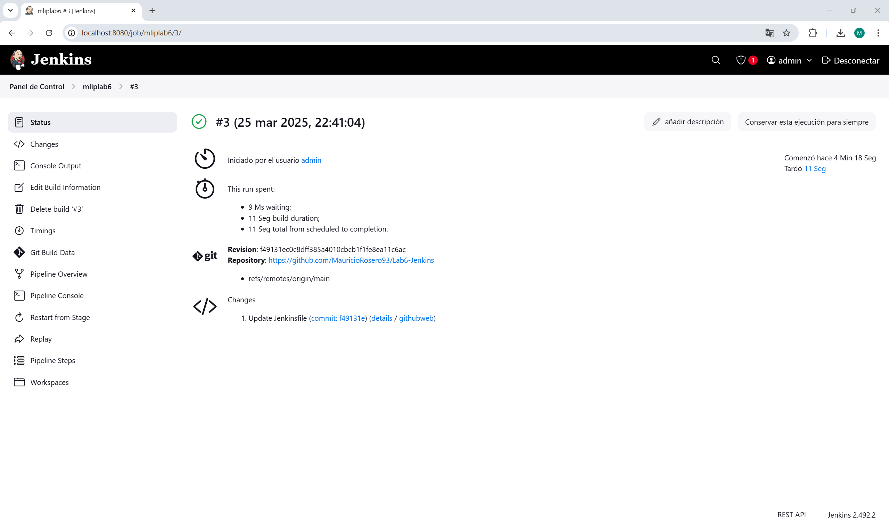
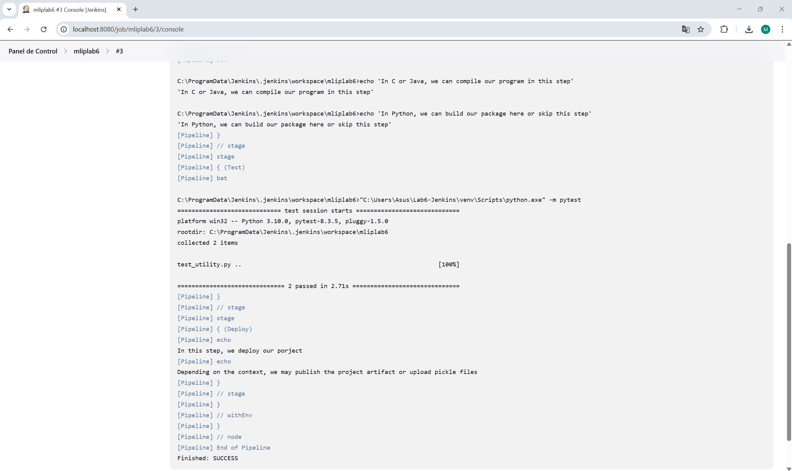

# Lab 6 - Continuous Integration with Jenkins

## Deliverables
- [ ] Show correct configuration of a Jenkins pipeline on **forked [Lab6 Github Repo](https://github.com/pedrogbmendes/MLIP_Lab6/)**. The build process must automatically fetch Jenkinsfile and run pipeline according to it.
- [ ] Complete the `jenkinsfile` to make the Jenkins pipeline test the repo during each build. Explain your understanding of what the given Jenkinsfile does.
- [ ] Complete the `test_data_split` function in `test_utility.py` to test data split step.

**Screenshots:**

